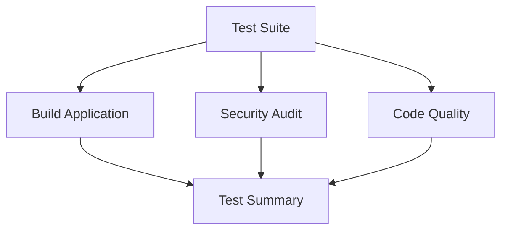

# CI/CD Documentation

This document describes the Continuous Integration and Continuous Deployment setup for the Fasting Frontend project.

## 🔧 Workflow Overview

The project uses three main GitHub Actions workflows:

### 1. CI/CD Pipeline (`ci.yml`)
**Triggers:** Push to `main`/`develop`/`FEAT/*`, Pull Requests, Manual Dispatch

**Jobs:**
- **Test Suite** - Runs all tests with coverage reporting
- **Build Application** - Creates production build and uploads artifacts  
- **Security Audit** - npm audit and vulnerability scanning
- **Code Quality** - Bundle size and dependency checks
- **Test Summary** - Aggregates results and provides feedback

### 2. Pull Request Checks (`pr-checks.yml`)  
**Triggers:** PR opened/updated, Manual Dispatch

**Jobs:**
- **Quick Validation** - Fast TypeScript and test validation
- **Test Matrix** - Runs unit, integration, and e2e test suites in parallel

### 3. Release Workflow (`release.yml`)
**Triggers:** Tag push (`v*.*.*`), Manual Dispatch with version input

**Jobs:**
- **Pre-Release Checks** - Full validation before release
- **Create Release** - Builds artifacts and creates GitHub release
- **Deploy** - Deployment to production environment
- **Notify** - Release completion notification

## ⚡ Smart Build Control

### Skip/Force Logic

#### Skip Conditions
Builds are automatically skipped when:

1. **Skip tokens in commit message or PR title:**
   - `[skip ci]` - Skip all CI workflows
   - `[ci skip]` - Skip all CI workflows
   - `[no ci]` - Skip all CI workflows
   - `[skip actions]` - Skip GitHub Actions
   - `[actions skip]` - Skip GitHub Actions
   - `[skip dev-ci]` - Skip only on develop branch
   - `[skip pr]` - Skip PR checks specifically
   - `[pr skip]` - Skip PR checks specifically

2. **Documentation-only changes:**
   - Changes only affecting: `**/*.md`, `LICENSE`, `.github/**`, `docs/**`
   - CI automatically detects and skips unless forced

#### Force Conditions
Builds are forced to run when:

1. **Force tokens in commit message or PR title:**
   - `[force ci]` - Force all CI workflows
   - `[ci force]` - Force all CI workflows  
   - `[force pr]` - Force PR checks
   - `[pr force]` - Force PR checks
   - `/ci run` - Force CI execution
   - `/run ci` - Force CI execution

2. **GitHub labels:**
   - `ci:force` - Force CI execution for the PR

3. **Manual workflow dispatch:**
   - Use GitHub Actions "Run workflow" with `force: true`

### Path Detection

The workflows use `dorny/paths-filter@v3` to detect changed file types:

**Documentation paths:**
```yaml
docs:
  - '**/*.md'
  - 'LICENSE' 
  - '.github/**'
  - 'docs/**'
```

**Code paths:**
```yaml
code:
  - 'src/**'
  - 'public/**'
  - 'tests/**'
  - 'package*.json'
  - '*.config.*'
  - 'tsconfig.json'
  - 'vite.config.ts'
  - 'vitest.config.ts'
```

## 🚨 Job Dependencies & Error Handling

### CI Pipeline Dependencies


### Conditional Job Execution
- **Build/Security/Quality** jobs run if Test job succeeds OR is skipped
- **Test Summary** always runs to provide feedback
- Jobs handle both `success` and `skipped` states gracefully

### Error Scenarios
- Failed tests block downstream jobs
- Security vulnerabilities (high/critical) fail the build
- Build failures are reported with detailed logs
- Manual intervention possible via workflow dispatch

## 🔄 Concurrency Control

Both CI and PR workflows use concurrency control to prevent resource waste:

```yaml
concurrency:
  group: ${{ github.workflow }}-${{ github.event.pull_request.number || github.ref }}
  cancel-in-progress: true
```

- **PR workflows**: Grouped by PR number, cancels older runs
- **Branch workflows**: Grouped by branch ref, cancels older runs
- **Manual dispatch**: Grouped by workflow name and ref

## 📊 Reporting & Feedback

### Job Summaries
Each workflow provides detailed summaries in GitHub Actions:

- **CI Pipeline**: Table of job results with status indicators
- **PR Checks**: Matrix test results with detailed output  
- **Release**: Release notes with changelog and artifact links

### Coverage Reporting
- **Codecov Integration**: Coverage reports uploaded automatically
- **Threshold**: Configured via `.audit-ci.json`
- **Fail Conditions**: High/critical vulnerabilities only

### Status Badges
README includes live status badges for all workflows:
- CI/CD Pipeline status
- Pull Request Checks status  
- Release Workflow status

## 🔐 Security & Permissions

### Minimal Permissions
All workflows use minimal required permissions:
```yaml
permissions:
  contents: read  # Default for most jobs
  # contents: write  # Only for release job
```

### Secrets & Environment Variables
- **JWT_SECRET**: Test-only secret for CI environment
- **CODECOV_TOKEN**: Optional for coverage upload
- **NODE_ENV**: Set to 'production' for deploy jobs

### Audit Configuration
Security scanning configured via `.audit-ci.json`:
```json
{
  "low": false,     // Don't fail on low severity
  "moderate": false, // Don't fail on moderate severity  
  "high": true,     // Fail on high severity
  "critical": true  // Fail on critical severity
}
```

## 🛠️ Maintenance & Troubleshooting

### Common Issues

1. **Tests stuck in skipped state**
   - Check for skip tokens in recent commits
   - Add `[force ci]` to re-run
   - Use manual workflow dispatch

2. **Docs-only changes triggering CI**
   - Verify path filters are working
   - Check if non-docs files were modified
   - Use skip tokens if needed

3. **Security audit failures**
   - Review vulnerability report
   - Update dependencies: `npm audit fix`
   - Adjust `.audit-ci.json` if needed

4. **Build artifacts missing**  
   - Check build job succeeded
   - Verify artifact upload step
   - Download from Actions tab

### Manual Intervention

**Force CI for specific commit:**
```bash
git commit --amend -m "Original message [force ci]"
git push --force-with-lease
```

**Skip CI for emergency fix:**
```bash
git commit -m "Hotfix: critical bug [skip ci]"
```

**Manual workflow dispatch:**
1. Go to GitHub Actions tab
2. Select desired workflow
3. Click "Run workflow"  
4. Set parameters as needed
5. Click "Run workflow"

## 📈 Performance & Optimization

### Caching Strategy
- **npm dependencies**: Cached by `actions/setup-node@v4`
- **Build artifacts**: Uploaded for 7 days retention
- **Test results**: Cached between test matrix jobs

### Parallel Execution
- **PR test matrix**: unit/integration/e2e run in parallel
- **CI jobs**: Security and quality checks run in parallel after tests
- **Resource limits**: Ubuntu runners with reasonable timeouts

### Build Time Optimization
- **Skip unnecessary jobs**: Smart skip/force logic saves compute time
- **Artifact reuse**: Build artifacts shared between jobs
- **Fail-fast disabled**: PR matrix completes all tests for full feedback

---

For more details on specific workflows, see the `.github/workflows/` directory.
